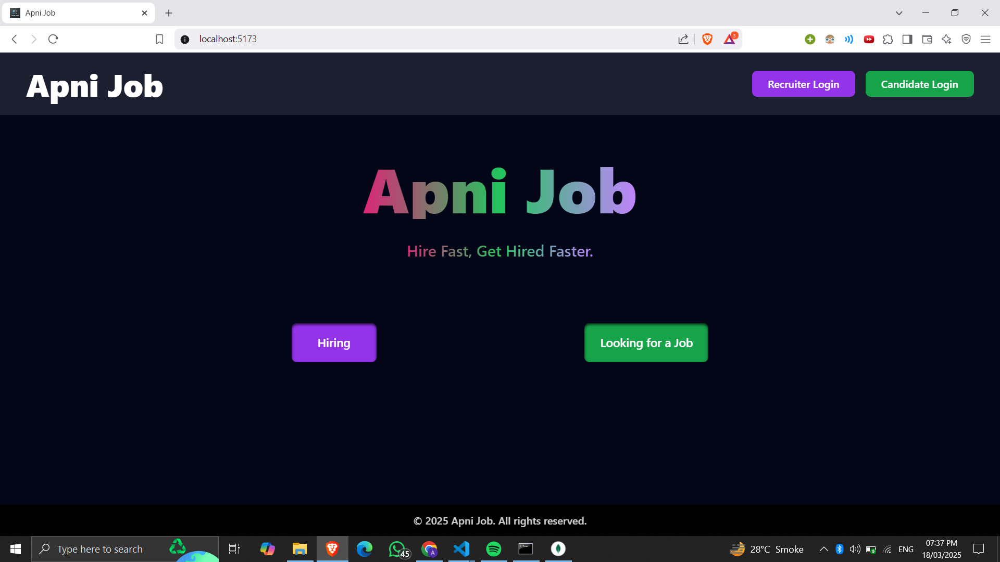
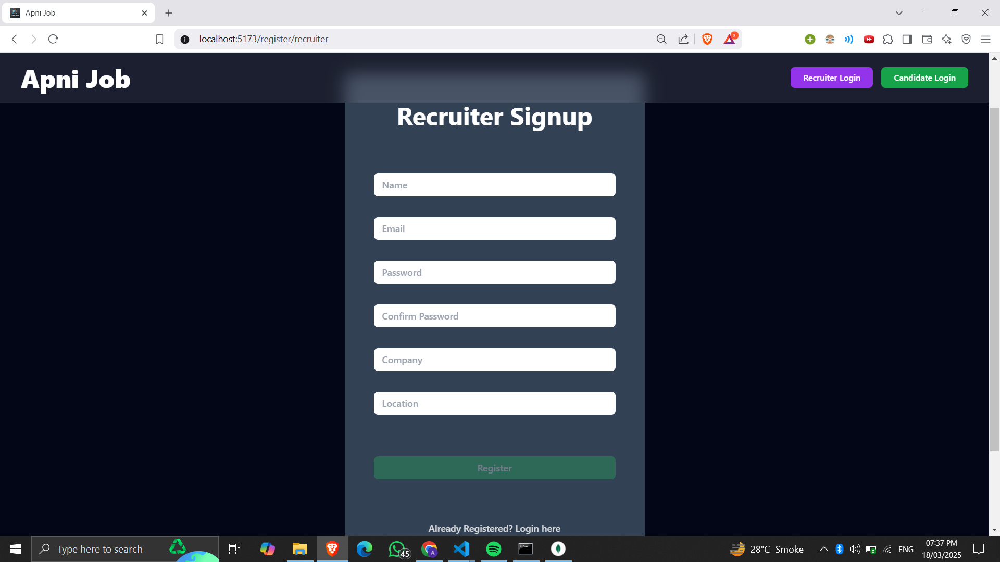
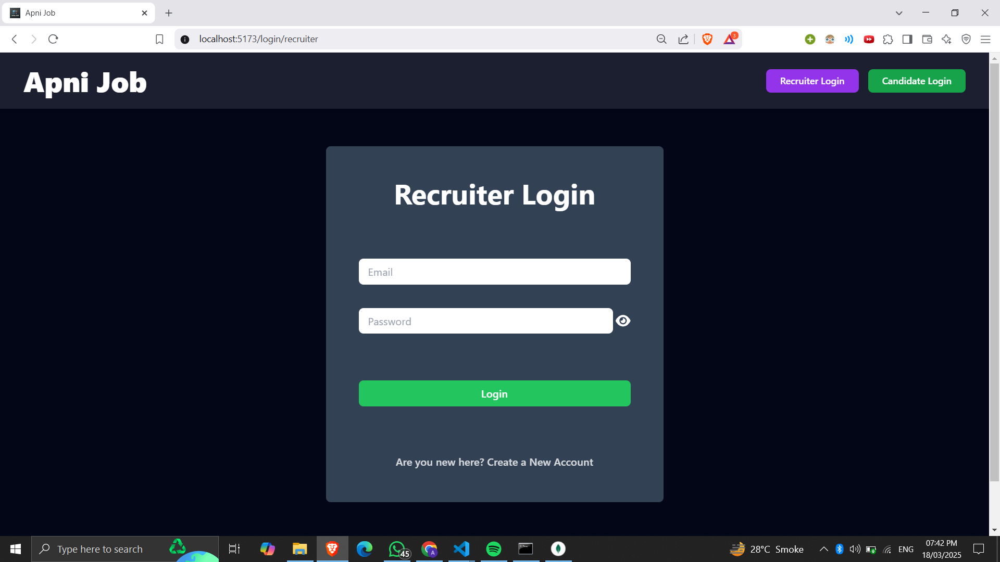
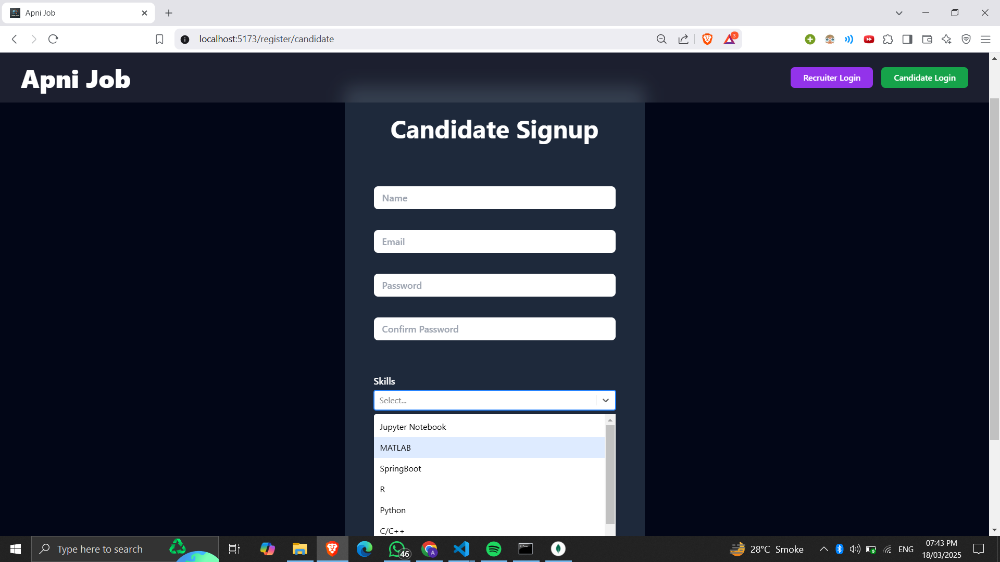
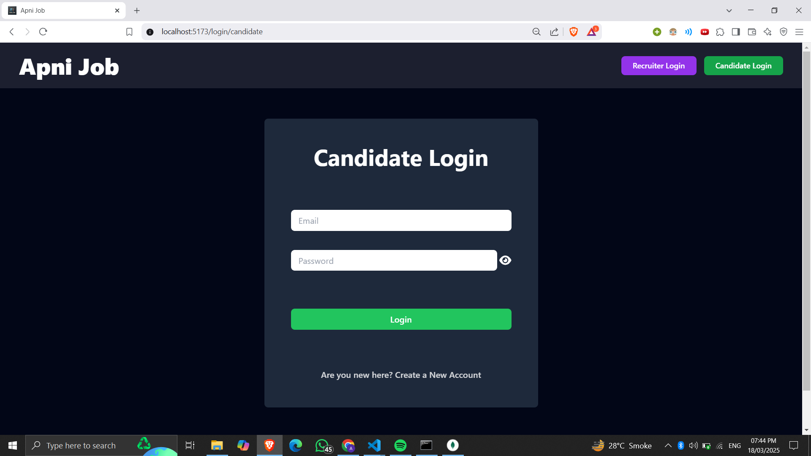
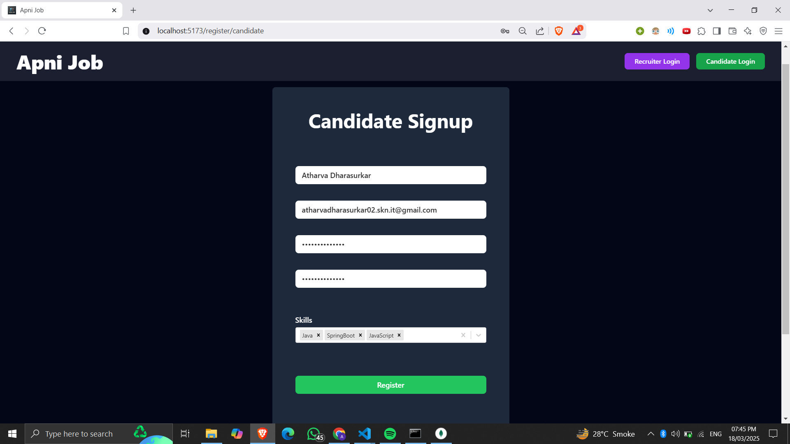
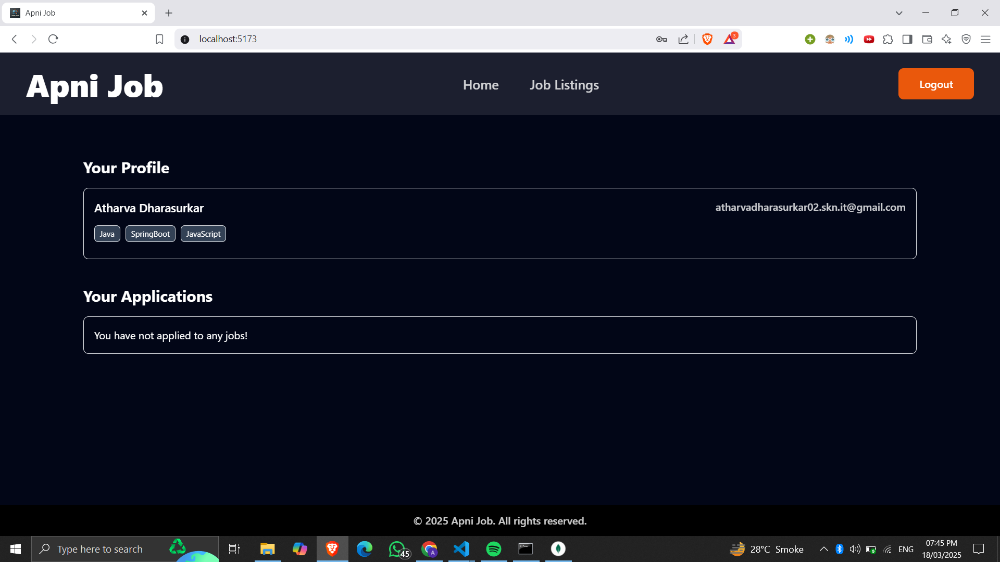
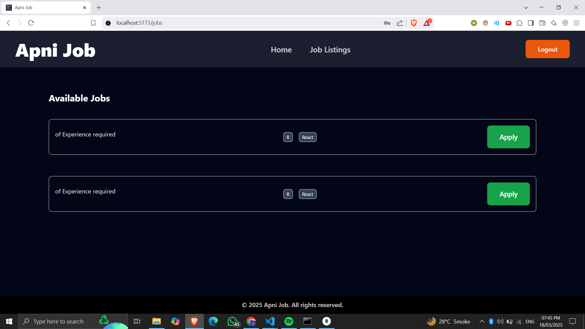
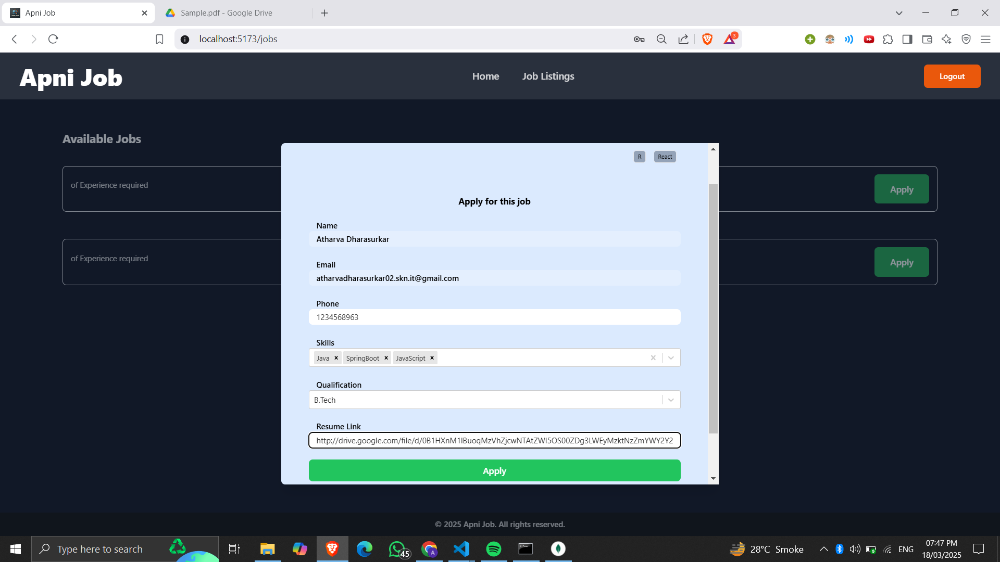

# Apni-Job-Portal 🏢👨‍💻

This full-stack Job Portal allows candidates to search and apply for jobs while enabling recruiters to post job openings and manage applications.

## Tech Stack
- **Frontend:** React, Tailwind CSS
- **Backend:** Spring Boot
- **Database:** MongoDB
